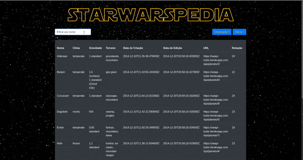

# StarWarsPedia

<center>
    
</center>

Este projeto tem como proposta a criação de uma tabela:

- Alimentada via API
- Ordenável
- Filtrável
- Com paginação

Esta tabela exibe **todos os planetas** do universo _Star Wars_. Para seu _frontend_ foi utilizada a tecnologia React, com as bilbiotecas [styled-components](https://styled-components.com/), [constate](https://github.com/diegohaz/constate), [create-react-app](https://github.com/facebook/create-react-app) e [TypeScript](https://www.typescriptlang.org/).

## Preview

<center>
    
</center>

## Iniciando o projeto

Para iniciar o projeto, você deve primeiro instalar as bibliotecas do projeto e em seguida rodar o _script_ de `start`.

```bash
npm i # ou yarn
npm start # ou yarn start
```

## Licença

[MIT](./LICENSE)
